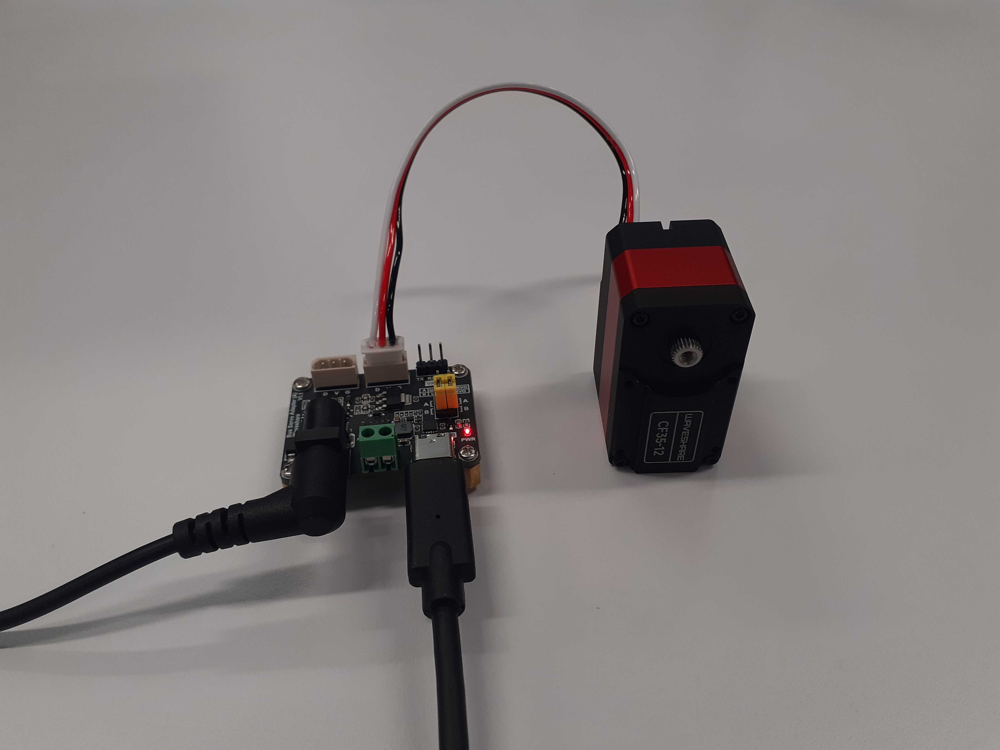

# CFServo_Python

A Python SDK for controlling the Waveshare CF35-12 servo, modified from the Waveshare STServo Python SDK
- Addition of a torque parameter to several write functions
- Addition of address/protocol macros specific to the CF35-12 servo
- Changing variable and macro name prefixes (ST -> CF)

<br>


## Repository Structure

```
CFServo_Python
├── cfscl
└── cfservo_sdk
```

The `cfscl` directory contains examples of using the library

The `cfservo_sdk` directory contains the source code of the library

## Usage

(Optional) Create conda environment
```bash
conda create -n cfservo_env python==3.12
```

Clone repo
```bash
git clone https://github.com/apaik458/CFServo_Python.git
```

Install required Python packages
```bash
pip install -r requirements.txt
```

Test servo with example scripts
```bash
cd cfscl
python ping.py
```

## Acknowledgements

This code is based on the Waveshare STServo Python SDK, which can be found on the Waveshare website

This project has no official affiliation with the Waveshare organisation